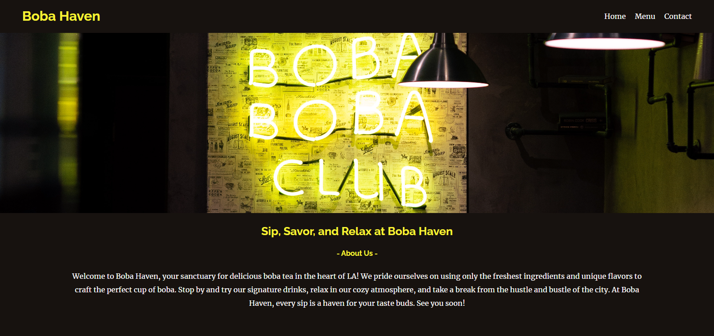

# Week 1 Mini-Project - Landing Page

In this mini-project, I practiced building a Github Repo and learned how to deploy a repo on Github-pages by building a landing page using HTML and CSS. I chose to use ChatGPT to give me an idea for my landing page by having it create me business ideas. After choosing an idea I used AI to create all of my websites information and then I built my pages layout and design around that.

## Boba Haven Demo

The following image shows the web application's appearance and functionality:

> **Note**: This layout is designed for desktop viewing, so you may notice that some of the elements don't look like the mock-up at a resolution smaller than 768px.

## Links

- Github Repository: https://github.com/that-devguy/BobaHaven-Landing-Page

- Deployed Application: https://that-devguy.github.io/BobaHaven-Landing-Page/